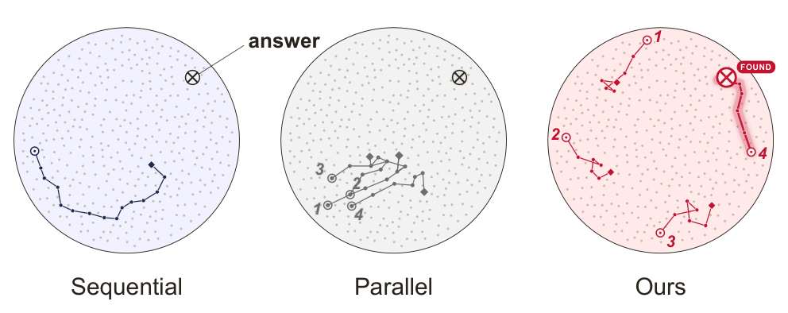
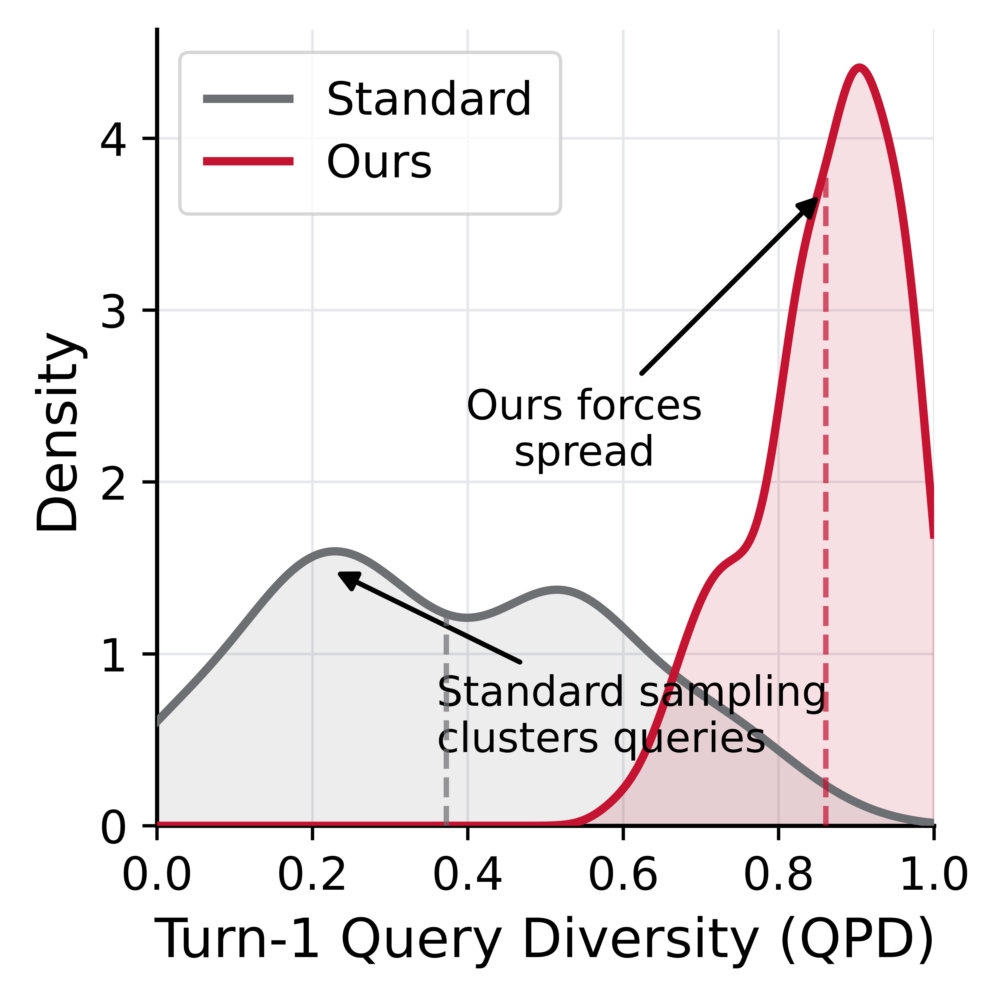
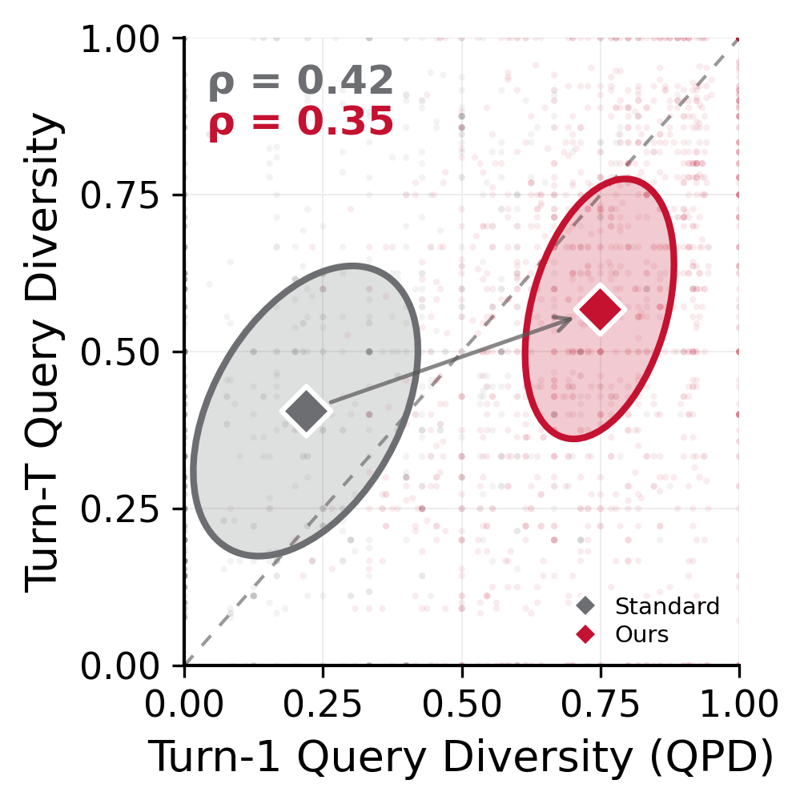
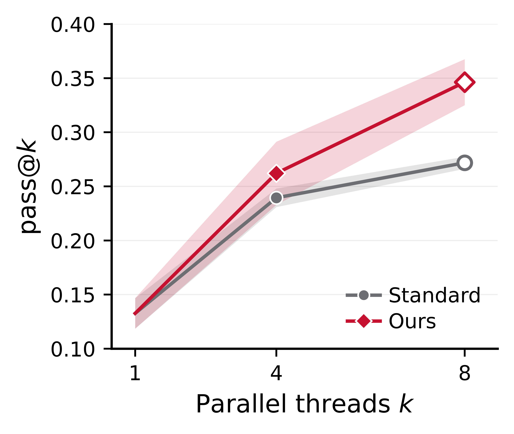
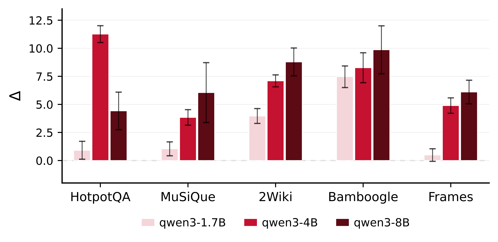

<h1 align="center">Beyond Parallel Sampling:<br>Diverse Query Initialization for Parallel Agentic Search</h1>

<div align="center">
<a href="https://github.com/sid-in-the-loop">Sidhaarth Murali</a>,
<a href="#">João Coelho</a>,
Jingjie Ning,
João Magalhães,
Bruno Martins,
<a href="#">Chenyan Xiong</a>

Carnegie Mellon University &nbsp;·&nbsp; IST Lisboa / INESC-ID &nbsp;·&nbsp; Universidade Nova de Lisboa
</div>

<div align="center">

[](#citation)
[](./LICENSE)

</div>

---

<div align="center">
  
</div>

More parallel threads should mean better coverage of the search space. In practice, they don't — they collapse onto the same first query, retrieve the same evidence, and fail together. We call this **anchor collapse**, and we fix it with a single training-free intervention: **DivInit**.

---

## Why Parallel Sampling Underperforms

Standard parallel sampling launches *k* threads independently. At temperature > 0, you'd expect diversity. Instead, threads cluster at near-identical turn-1 queries (QPD ≈ 0.2) — and that first query anchors everything that follows.

<div align="center">
  
</div>

The turn-1 query isn't just the first step — it's the trajectory. Once threads retrieve similar evidence early, they stay coupled: same documents, same reasoning path, same failure mode. Higher temperature helps at the margins but never closes the gap.

<div align="center">
  
  <p><i>Turn-1 diversity predicts full-trajectory diversity. Standard threads cluster at low QPD; DivInit shifts them to high QPD — and that separation persists across all turns (ρ = 0.42 / 0.35).</i></p>
</div>

## DivInit

One intervention, at turn 1 only:

1. Generate a **pool of *n* candidate queries** in a single LLM call
2. Select *k* seeds via **MMR** (greedy max-min Jaccard, λ=0)
3. Launch one thread per seed — everything from turn 2 is unchanged

```
Standard:  k × T calls   (k independent turn-1 calls)
DivInit:   1 + k(T−1)    (one pool call, k−1 fewer total)
```

No training. No reward model. Selection is milliseconds of token-level Jaccard arithmetic. Plugs into any ReAct-style agent.

## Results

<div align="center">
  
  <p><i>pass@k vs. threads k, averaged across benchmarks. The gap widens as k grows — more threads amplify the benefit of diverse initialization.</i></p>
</div>

Across five open-weight models and eight benchmarks, DivInit improves pass@4 by **+5–7 points on multi-hop QA** at matched compute. The gains are consistent and scale with model size — near-zero at 1.7B, largest at 8B — pointing to a capacity floor below which models can't productively act on varied seeds.

<div align="center">
  
  <p><i>Absolute pass@4 gain (DivInit − Standard) per dataset and Qwen3 model size. Larger models benefit more.</i></p>
</div>

**pass@4 (%)** — Standard → DivInit:

| Model | HpQA | MuSi | 2Wiki | Bambo | FRAMES | Avg↑ | GAIA | HLE | WebWalker | Avg↑ |
|-------|------|------|-------|-------|--------|------|------|-----|-----------|------|
| Qwen3-1.7B | 42.9→**43.8** | 14.5→**15.6** | 37.6→**41.5** | 16.8→**24.3** | 13.1→**13.6** | 25.0→**27.8** | — | — | — | — |
| Qwen3-4B | 41.9→**53.2** | 15.9→**19.7** | 41.9→**49.0** | 32.5→**40.8** | 15.5→**20.4** | 29.5→**36.6** | 22.7→**27.8** | 9.7→**14.3** | 38.7→**44.9** | 23.7→**29.0** |
| Qwen3-8B | 50.4→**57.0** | 23.9→**29.7** | 46.3→**55.1** | 47.7→**57.6** | 24.8→**30.8** | 38.6→**46.0** | 26.0→**30.2** | 10.0→**14.1** | 41.6→**46.8** | 25.2→**28.2** |
| Gemma3-4B | 40.0→**49.2** | 17.2→16.1 | 42.8→**52.2** | 27.7→**37.9** | 12.3→**14.7** | 28.0→**34.0** | — | — | — | — |
| Gemma3-12B | 54.9→**59.1** | 31.6→**36.1** | 52.0→**53.9** | 55.7→**64.3** | 31.0→**37.5** | 45.0→**50.2** | 34.0→**35.0** | 12.7→**14.8** | 38.0→**45.2** | 28.2→**31.6** |

## Repository Structure

| Path | Description |
|------|-------------|
| `general_agent/webwalkerqa/` | Core agent, DivInit method, evaluation |
| `general_agent/data/main_table/` | 8 benchmark datasets (`.json`) |
| `paper_assets/figures/` | Paper figures with generation scripts |
| `AggAgent/` | AggAgent submodule (Lee et al., 2026) |

## Getting Started

```bash
cd general_agent
pip install -e .
pip install litellm sentence-transformers httpx python-dotenv
```

Create `general_agent/.env`:
```
OPENAI_API_KEY=...
SERPER_API_KEY=...
```

```bash
# multi-hop QA (HotpotQA, MuSiQue, 2WikiMHQA, Bamboogle, FRAMES)
python -m webwalkerqa.run.run_main_table \
  --model openai/gpt-4o-mini \
  --dataset data/main_table/hotpotqa.json \
  --condition diversity_parallel \
  --k 4 --pool-size 16 --max-turns-par 8 \
  --prompt-style react_simple \
  --output-dir ../results/my_run

# open-web (GAIA, HLE, WebWalker) — add SERPER_API_KEY to .env
python -m webwalkerqa.run.run_main_table \
  --model openai/gpt-4o-mini \
  --dataset data/main_table/gaia.json \
  --condition diversity_parallel \
  --k 4 --pool-size 16 --max-turns-par 8 \
  --prompt-style web_reasoning \
  --output-dir ../results/my_run
```

## Reproducing Results

Available conditions: `diversity_parallel` (DivInit), `naive_parallel` (baseline), `sequential`.

**Open models** (Qwen3, Gemma3) — start a vLLM server, then point `--api-base` at it:
```bash
vllm serve Qwen/Qwen3-8B --port 8003 --enable-prefix-caching --dtype auto --max-model-len 32768

cd general_agent
python -m webwalkerqa.run.run_main_table \
  --model openai/Qwen/Qwen3-8B \
  --api-base http://localhost:8003/v1 \
  --dataset data/main_table/hotpotqa.json \
  --condition diversity_parallel \
  --k 4 --pool-size 16 --max-turns-par 8 \
  --prompt-style react_simple \
  --output-dir ../results/my_run
```

**Closed models** (GPT-4o-mini, Gemini) — set `OPENAI_API_KEY` / `GEMINI_API_KEY` in `.env`:
```bash
cd general_agent
python -m webwalkerqa.run.run_main_table \
  --model openai/gpt-4o-mini \
  --dataset data/main_table/hotpotqa.json \
  --condition diversity_parallel \
  --k 4 --pool-size 16 --max-turns-par 8 \
  --prompt-style react_simple \
  --output-dir ../results/my_run
```

**Aggregate results:**
```bash
cd general_agent
python -m webwalkerqa.scripts.aggregate_results --results-dir ../results/my_run
```

## Citation

```bibtex
@inproceedings{murali2026divinit,
  title     = {Beyond Parallel Sampling: Diverse Query Initialization for Parallel Agentic Search},
  author    = {Murali, Sidhaarth and Coelho, Jo{\~a}o and Ning, Jingjie and Magalh{\~a}es, Jo{\~a}o and Martins, Bruno and Xiong, Chenyan},
  year      = {2026},
  note      = {Preprint}
}
```

## License

MIT — see [LICENSE](LICENSE).
